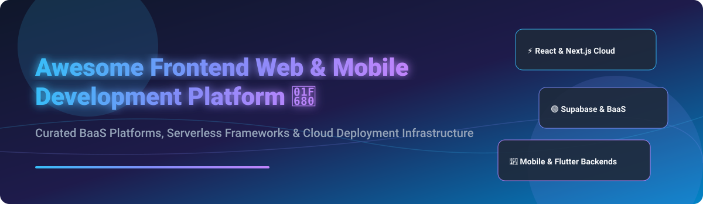

# Awesome-Frontend-Web-Mobile-Development-Platform

# Awesome-Frontend-Web-Mobile-Development-Platform 🌐 📱



  





  
  
  
  
  
  



---

## 🌟 Top Frontend Web & Mobile Development Platform Ecosystem

**Curated List of Commercial BaaS Platforms & Open-Source Backend Frameworks**  
*Focused on Backend-as-a-Service, Serverless Functions, Authentication, Real-Time Databases, Static Site Hosting & Self-Hosted Development Platforms*

**Last updated: October 2026** 📅

---

### 📌 Overview & SEO Summary
Welcome to the ultimate curated directory of **frontend web and mobile development platforms**, **open-source backend-as-a-service frameworks**, and **serverless deployment tools**. Whether you are looking for enterprise-grade commercial solutions (such as *AWS Amplify*, *Firebase*, and *Vercel*), or self-hostable open-source alternatives (like *Supabase*, *Appwrite*, and *PocketBase*), this list covers category leaders, real-time databases, and privacy-respecting development infrastructure.

**Key Market Context:**
- **Firebase** is the **most widely adopted BaaS platform**, with **real-time database, authentication, and cloud functions** — used by millions of developers.
- **Supabase** is the **leading open-source Firebase alternative**, with **75K+ GitHub stars** and **PostgreSQL-based real-time, auth, and storage**.
- **PocketBase** is the **lightest open-source BaaS**, with **40K+ GitHub stars** and **SQLite-based backend in a single file**.

---

## 📑 Table of Contents
- [🏢 SaaS & Commercial Platforms](#-saas--commercial-platforms)
- [🔓 Open-Source GitHub Projects](#-open-source-github-projects)
- [🛠️ How to Contribute](#%EF%B8%8F-how-to-contribute)
- [📊 Star History](#-star-history)
- [🤝 Support & Sponsorship](#-support--sponsorship)
- [⚠️ Disclaimer](#%EF%B8%8F-disclaimer)

---

## 🏢 SaaS / Commercial Platforms

The frontend web and mobile development platform market spans **hyperscaler BaaS platforms** (Firebase, AWS Amplify) that provide **deep cloud integration with real-time databases and authentication**, **modern deployment platforms** (Vercel, Netlify) that focus on **static site hosting and serverless functions**, and **open-core BaaS platforms** (Supabase, Appwrite) that offer **self-hosted alternatives with managed cloud options**. **Firebase** offers a **free Spark plan** with **paid Blaze plan from $25/month** . **AWS Amplify** offers a **free tier with 1,000 build minutes/month** . **Vercel** offers a **free Hobby plan** with **Pro from $20/user/month** . **Supabase** offers a **free tier with 500 MB database** and **Pro from $25/month** . **Appwrite** offers a **free tier with 1 GB storage** and **Pro from $15/month** .

| SaaS / Commercial Platform | Company / Owner | Valuation / Market Cap | Standard Edition Starting Price | Free Tier / Free Trial Limits | Description |
| :--- | :--- | :--- | :--- | :--- | :--- |
| **[AWS Amplify](https://aws.amazon.com/amplify/)** ☁️ | Amazon | ~$2.0 Trillion | **Pay-as-you-go** for build minutes, hosting, and backend services | **Free tier: 1,000 build minutes/month, 15 GB hosting**  | **AWS-native frontend platform** — **Build, deploy, and host full-stack web and mobile apps** . **Authentication, APIs, storage, and analytics** . **Deep integration with AWS services** . **Amplify Studio for visual development** . |
| **[Firebase](https://firebase.google.com/)** 🔥 | Google (Alphabet) | ~$2.0 Trillion | **Blaze plan from $25/month** (pay-as-you-go) | **Free Spark plan: 10 GB storage, 1 GB Firestore, 10 GB hosting**  | **Google-native BaaS platform** — **Real-time database, Firestore, authentication, cloud functions, and hosting** . **The most widely adopted BaaS platform** . **Deep integration with Google Cloud** . |
| **[Supabase](https://supabase.com/)** 🟢 | Supabase | ~$2 Billion | **Pro: $25/month**; **Team: $599/month**  | **Free: 500 MB database, 1 GB storage, 50K monthly active users**  | **Open-source Firebase alternative** — **PostgreSQL-based real-time, auth, storage, and edge functions** . **The most popular open-source BaaS platform** . **Self-hosted or cloud** . |
| **[Vercel](https://vercel.com/)** ▲ | Vercel | ~$3.5 Billion | **Pro: $20/user/month**; **Enterprise: custom**  | **Free Hobby plan: 100 GB bandwidth, 100 builds/day**  | **Frontend cloud platform** — **Static site hosting, serverless functions, and edge computing** . **The creators of Next.js** . **The most developer-friendly deployment platform** . |
| **[Netlify](https://www.netlify.com/)** 🔵 | Netlify | ~$2 Billion | **Pro: $19/user/month**; **Business: $99/user/month**  | **Free: 100 GB bandwidth, 300 build minutes/month**  | **Web development platform** — **Static site hosting, serverless functions, and edge handlers** . **The original static site hosting platform** . |
| **[Appwrite](https://appwrite.io/)** 🟣 | Appwrite | Private | **Pro: $15/month**; **Enterprise: custom**  | **Free: 1 GB storage, 75K monthly active users**  | **Open-source BaaS platform** — **Authentication, databases, storage, and functions** . **Self-hosted or cloud** . **The most complete open-source BaaS platform** . |
| **[Backendless](https://backendless.com/)** 🔶 | Backendless | Private | **Custom pricing**  | **Free: 1 app, 50 API calls/second**  | **Visual app development platform** — **Backend-as-a-Service with UI Builder** . **Real-time database, authentication, and push notifications** . |
| **[Parse](https://parseplatform.org/)** 🏛️ | Parse Platform (Open Source) | N/A (Open Source) | **Self-hosted free**; **Parse Cloud from $25/month**  | **Free: self-hosted**  | **Open-source BaaS platform** — **The original BaaS** . **Self-hosted or Parse Cloud** . **The foundation for modern BaaS platforms** . |
| **[Render](https://render.com/)** 🚀 | Render | Private | **$7/month** per service  | **Free: static sites**  | **Unified cloud platform** — **Static sites, web services, databases, and cron jobs** . **Git-push deploys with automatic SSL** . |
| **[Railway](https://railway.app/)** 🚂 | Railway | Private | **$5/month** (usage-based) | **$5 free credit/month**  | **Modern application hosting** — **Instant deploys from Git** . **Managed databases and cron jobs** . **Template marketplace** . |

---

## 🔓 Open-Source GitHub Projects

*Sorted by GitHub_Stars_Count (Descending)* 🌟

- **[Supabase](https://github.com/supabase/supabase)**   
  **The open-source Firebase alternative**, Apache-2.0 licensed. **75K+ GitHub stars** — **PostgreSQL-based real-time, auth, storage, and edge functions** . **Self-hosted or Supabase Cloud** . **The most popular open-source BaaS platform** . **The definitive Firebase alternative** . 🟢

- **[PocketBase](https://github.com/pocketbase/pocketbase)**   
  **Open-source backend in a single file**, MIT licensed. **40K+ GitHub stars** — **SQLite-based backend with real-time subscriptions, authentication, and file storage** . **Single executable** — no dependencies . **The lightest open-source BaaS platform** . 📦

- **[Appwrite](https://github.com/appwrite/appwrite)**   
  **Open-source BaaS platform**, BSD-3-Clause licensed. **45K+ GitHub stars** — **authentication, databases, storage, and functions** . **Self-hosted or cloud** . **The most complete open-source BaaS platform** . 🟣

- **[Parse Platform](https://github.com/parse-community/parse-server)**   
  **Open-source BaaS platform**, Apache-2.0 licensed. **The original BaaS** — **self-hosted or Parse Cloud** . **Real-time database, authentication, and push notifications** . **The foundation for modern BaaS platforms** . 🏛️

- **[Strapi](https://github.com/strapi/strapi)**   
  **Open-source headless CMS**, MIT licensed. **65K+ GitHub stars** — **REST and GraphQL APIs** . **Self-hosted or Strapi Cloud** . **The most popular open-source headless CMS** . 🚀

- **[Directus](https://github.com/directus/directus)**   
  **Open-source data platform**, BSL-1.1 licensed. **30K+ GitHub stars** — **instant REST and GraphQL APIs** . **No-code data management** . **The most flexible open-source data platform** . 🎯

- **[Nhost](https://github.com/nhost/nhost)**   
  **Open-source Firebase alternative with GraphQL**, MIT licensed. **8K+ GitHub stars** — **PostgreSQL, GraphQL, authentication, and storage** . **Self-hosted or Nhost Cloud** . **The most GraphQL-native BaaS platform** . 🔗

- **[Amplify (Open Source)](https://github.com/aws-amplify/amplify-js)**   
  **AWS Amplify JavaScript libraries**, Apache-2.0 licensed. **9K+ GitHub stars** — **the open-source client libraries for AWS Amplify** . **Auth, API, Storage, and Analytics** . **The foundation for AWS Amplify** . ☁️

- **[Firebase SDK (Open Source)](https://github.com/firebase/firebase-js-sdk)**   
  **Firebase JavaScript SDK**, Apache-2.0 licensed. **10K+ GitHub stars** — **the open-source client libraries for Firebase** . **Auth, Firestore, Storage, and Functions** . **The foundation for Firebase** . 🔥

- **[Kuzzle](https://github.com/kuzzleio/kuzzle)**   
  **Open-source backend for web and mobile apps**, Apache-2.0 licensed. **The most complete open-source BaaS platform after Supabase and Appwrite** . **Real-time database, authentication, and APIs** . 🎯

- **[LoopBack](https://github.com/loopbackio/loopback-next)**   
  **Open-source Node.js API framework**, MIT licensed. **The most mature open-source API framework for BaaS** . **REST and GraphQL APIs** . **The foundation for enterprise BaaS platforms** . 🔧

- **[Feathers](https://github.com/feathersjs/feathers)**   
  **Open-source web framework for real-time applications**, MIT licensed. **15K+ GitHub stars** — **REST and real-time APIs** . **The most real-time focused open-source BaaS framework** . ⚡

---

## 🛠️ How to Contribute

Contributions are welcome! Follow these steps to submit new frontend development platforms or open-source BaaS software:

1. 🍴 **Fork** the repository.
2. 📝 **Add/edit** entries in `README.md` maintaining table/list structure and formatting.
3. 🔗 Include project title, official website/GitHub link, exact Stars_Count, license, and brief description.
4. 🚀 Submit a **Pull Request** with a descriptive summary of your changes.

---

## 📊 Star History



---

## 🤝 Support & Sponsorship

If you find this frontend development platform repository useful, please consider supporting the project:

- ⭐ **Star** this repository to increase visibility!
- 🔀 **Fork** and share with fellow developers, indie hackers, and open-source advocates.
- ☕ **Sponsor & Buy Me a Coffee**: Support ongoing open-source curation via the [GitHub Sponsor Dashboard](https://github.com/sponsors/ishandutta2007).

---

## ⚠️ Disclaimer

- This is a **community-curated** list — not exhaustive and not an endorsement. ℹ️
- **Supabase is the leading open-source Firebase alternative** with **75K+ GitHub stars** and **PostgreSQL-based real-time, auth, and storage** . **PocketBase is the lightest BaaS** with **40K+ GitHub stars** and **SQLite-based backend in a single file** . **Appwrite provides the most complete open-source BaaS platform** with **45K+ GitHub stars** .
- **Firebase offers a free Spark plan** with **paid Blaze from $25/month** . **Vercel offers a free Hobby plan** with **Pro from $20/user/month** . **Netlify offers free 100 GB bandwidth** with **Pro from $19/user/month** .
- **Open-source BaaS platforms are not turnkey** — they require **deployment, database configuration, and ongoing maintenance** . **Supabase requires PostgreSQL and Docker** . **Appwrite requires Docker** . **PocketBase requires a single executable** . **Always validate authentication, real-time performance, and security with a proof-of-concept** before production deployment . 🌐

---



  <b>Made with ❤️ for developers, indie hackers, and open-source BaaS advocates.</b>

